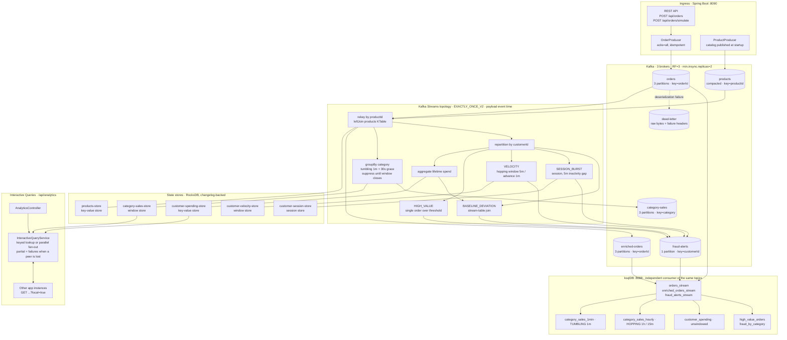

# Real-Time E-Commerce Order Analytics

**Kafka Streams + ksqlDB · Spring Boot 3.2 · Java 21 · Docker Compose**

> Originally built as a BITS Pilani coursework assignment — *Exploration of Streaming Architecture: Apache Kafka Streams & ksqlDB* — and since reworked to fix the correctness defects the first version shipped with. The assignment write-up lives in [`docs/answer-sheet.md`](docs/answer-sheet.md).

---

## What this is

An order-analytics pipeline that computes per-category sales windows and per-customer
anomaly signals from a live order stream, and serves the results straight out of the
stream processor's own state — no serving database in the path. Orders arrive on a Kafka
topic, are enriched with product catalog data via a KStream–KTable join, aggregated into
one-minute event-time windows, and screened by four independent anomaly detectors
(absolute value, order velocity, session burst, and deviation from the customer's own
running baseline). The same Kafka topics are read in parallel by a ksqlDB layer that
expresses a subset of the same logic in SQL, so the two engines can be compared directly
on identical input. The problem it addresses is the one batch analytics cannot: a
per-minute sales figure and a fraud signal are only worth having while the order is still
in flight, and both have to agree with each other about which minute an order belongs to.

The interesting engineering is in the details of *being correct while doing that* — exact
money arithmetic, a single shared notion of event time across two engines, honest
reporting when a distributed read is incomplete, and an explicit account of what the
exactly-once guarantee does and does not cover. Those are documented below, along with the
things this system still gets wrong.

---

## Architecture



Everything inside `TOPO`, `STORES` and `IQ` runs in one JVM. Scaling out means running the
same image again with a different port and advertised address — the compose stack does this
by default with `app-1` and `app-2`. Kafka reassigns partitions, each instance materialises
only its own shard of every store, and the REST layer fans out across instances to
reconstruct a whole answer.

---

## Quick start

**Requires JDK 21.** The Gradle build declares a Java 21 toolchain, so Gradle will resolve
or provision a JDK 21 on its own. If it cannot find one, point `JAVA_HOME` at a JDK 21
install before running the wrapper:

```bash
# macOS
export JAVA_HOME=$(/usr/libexec/java_home -v 21)
# Linux (example)
export JAVA_HOME=/usr/lib/jvm/java-21-openjdk
```

### Option A — the whole stack in Docker

`docker compose up -d` brings up Kafka (3 brokers), Schema Registry, ksqlDB, Kafka UI, the
Prometheus/Grafana observability stack, **and two application instances** built from the
`Dockerfile`. Topics and ksqlDB streams/tables are created by the `kafka-setup` and
`ksqldb-setup` one-shot containers.

```bash
docker compose up -d      # first run also builds the app image — expect a few minutes
docker compose ps         # kafka-setup / ksqldb-setup should read "Exited (0)"

# Produce 50 simulated orders through instance 1
curl -s -X POST "http://localhost:8090/api/orders/simulate?count=50"

# Read the windowed aggregates back out of the live state store.
# from=epoch returns every window the store holds, regardless of event time.
curl -s "http://localhost:8090/api/analytics/category-sales?from=1970-01-01T00:00:00Z" \
  | python3 -m json.tool

# The fan-out across both instances — check `partial` before trusting a total
curl -s "http://localhost:8090/api/analytics/customer-spending" | python3 -m json.tool
```

Two instances is the default on purpose. With one instance owning every partition, its
state store holds all the data and every query *looks* complete — which is exactly what hid
the silent-partial-results bug. Two instances split the partitions, so the discovery, RPC
fan-out and `partial` / `failures` reporting are actually exercised by `docker compose up`
rather than only in theory.

The two app containers are memory-limited to 1 GB each. On macOS and Windows the whole
stack is bounded by the Docker Desktop VM's memory allocation (often 8 GB by default); if
containers get OOM-killed, either raise that or use Option B.

### Option B — infrastructure in Docker, app on the host

Better for iterating on the topology. Start only the infrastructure services (their
`depends_on` pulls in Zookeeper), leaving ports 8090/8091 free:

```bash
docker compose up -d kafka-1 kafka-2 kafka-3 kafka-setup \
                     schema-registry ksqldb-server ksqldb-setup kafka-ui

./gradlew bootRun                                 # instance A on :8090
./gradlew bootRun --args='--server.port=8091'     # instance B on :8091 (optional)
```

Nothing but the port needs to change between the two JVMs: the advertised
`application.server` address defaults to `localhost:${server.port}`, and the RocksDB state
directory leaf is derived from `host-port`, so the second JVM does not collide with the
first on RocksDB's exclusive directory lock. `GET /api/analytics/streams/status` on either
instance then lists both, with the stores and partitions each one owns.

In a container or Kubernetes, `app.streams.application-server` **must** be set to an
address the other pods can reach — the compose services set `app-1:8090` / `app-2:8091`,
and the Kubernetes StatefulSet uses its headless-service DNS name. The default of
`localhost:${server.port}` resolves to the pod itself, so every instance would advertise
itself as everyone else's loopback and the fan-out would query itself.

### Tear down

```bash
docker compose down       # stop containers, keep topic data
docker compose down -v    # stop and wipe all volumes, including RocksDB state
```

---

## Service ports

| Service | URL | Notes |
|---|---|---|
| App instance 1 | http://localhost:8090 | REST API + Kafka Streams topology + Interactive Queries |
| App instance 2 | http://localhost:8091 | Second instance of the same application-id |
| Actuator | http://localhost:8090/actuator/health | `health`, `info`, `metrics` |
| Kafka UI | http://localhost:9090 | Browse topics, messages, consumer lag |
| ksqlDB server | http://localhost:8088 | Streaming SQL REST API |
| Schema Registry | http://localhost:8081 | Running, but **not used** — see limitations |
| Kafka brokers | localhost:9092 / :9093 / :9094 | `kafka-1`, `kafka-2`, `kafka-3`; inside the compose network: `kafka-1:29092`, `kafka-2:29093`, `kafka-3:29094` |
| Prometheus | http://localhost:9091 | 9090 is taken by Kafka UI |
| Grafana | http://localhost:3000 | Anonymous viewer access; admin/admin |
| kafka-exporter | http://localhost:9308/metrics | Broker, topic and consumer-group metrics |

---

## Kafka topics

All six are created with replication factor 3 and `min.insync.replicas=2` by
`docker/kafka-init.sh`, and declared identically as `NewTopic` beans in
`KafkaTopicConfig.java` so a fresh cluster is provisioned the same way either route.

| Topic | Partitions | Key | Value | Written by |
|---|---|---|---|---|
| `orders` | 3 | `orderId` | `Order` JSON | `OrderProducer` (REST + simulator) |
| `products` | 3, compacted | `productId` | `Product` JSON | `ProductProducer` at startup |
| `enriched-orders` | 3 | `orderId` | `EnrichedOrder` JSON | Streams topology |
| `fraud-alerts` | 1 | `customerId` | `OrderAlert` JSON | Streams topology (all four signals) |
| `category-sales` | 3 | `category` | `CategorySales` JSON | Streams topology |
| `dead-letter` | 3, 30-day retention | original key bytes | original value bytes + `dlq.*` headers | `DeadLetterDeserializationExceptionHandler` |

Kafka Streams additionally creates its own internal repartition and changelog topics
(prefixed `ecommerce-streams-app-`), also at RF=3 / `min.insync.replicas=2`.

---

## REST API

Base URL `http://localhost:8090`.

### Analytics — Interactive Queries

| Endpoint | Parameters | Description |
|---|---|---|
| `GET /api/analytics/category-sales` | `from`, `to` (ISO-8601), `windowMinutes` (default `2`), `local` (default `false`) | One entry per `(category, windowStart, windowEnd)` from `category-sales-store`. |
| `GET /api/analytics/customer-spending` | `local` (default `false`) | Lifetime running spend for every customer, ranked by `totalSpent` descending. Fans out across instances. |
| `GET /api/analytics/customer-spending/{customerId}` | `local` (default `false`) | Lifetime spend for one customer. Keyed lookup — one targeted hop to the owning instance, never a fan-out. Unknown customer is `200` with `found: false`, not `404`. |
| `GET /api/analytics/streams/status` | — | Kafka Streams lifecycle state plus every discovered instance with its stores and partitions. Always `200`, including mid-rebalance — it is what you call to find out why the others are returning 503. |

**`from` / `to` are event time, not wall clock.** The window store is keyed by the order's
own `timestamp` field (see `OrderTimestampExtractor`), and the range is matched against
window **start** times. `windowMinutes` is a convenience that still anchors on
`Instant.now()`; after a restart, `auto.offset.reset=earliest` replays the topic and fills
the store with windows whose event times are in the past, so a wall-clock range can
legitimately return nothing while the app is working perfectly. Pass `from` and `to`
explicitly whenever you care, or `from=1970-01-01T00:00:00Z` to see everything the store
holds. `windowMinutes` must be between 1 and 10080 (7 days); anything else is a `400`.

### `partial: true` — read this before consuming the API

A Kafka Streams state store is **sharded by partition**. `store.all()` and
`store.fetchAll()` iterate only the partitions *this* instance was assigned; there is no
cluster-wide iterator. The unkeyed endpoints therefore discover every instance hosting the
store, query them all in parallel, and merge — and when some instance cannot be reached,
they say so instead of quietly returning less data:

```jsonc
{
  "fetchedAt": "2026-09-04T12:00:00Z",
  "partial": true,                       // <-- the body is a SUBSET of the real answer
  "hostsQueried": ["localhost:8090", "localhost:8091"],
  "failures": [
    { "host": "localhost:8091", "reason": "TIMEOUT",
      "detail": "Did not answer within the 5000ms fan-out budget." }
  ],
  "localOnly": false,
  "totalCustomers": 7,
  "customers": [ /* ... */ ]
}
```

**Branch on `partial`.** A `partial: true` response is not an error and carries real data,
but summing it and presenting the result as a total is wrong. `failures[].reason` is one
of `TIMEOUT`, `RPC_FAILED`, `STORE_NOT_AVAILABLE`, `REBALANCING`, `NO_APPLICATION_SERVER`,
`INTERRUPTED` or `QUERY_FAILED`. If *every* host fails, the request returns `503` rather
than an empty list that reads like "no data". This behaviour is the entire point of the
multi-instance work: before it, the API returned one instance's partitions with HTTP 200
and no indication that the rest of the answer was missing.

`local=true` makes an instance answer from its own partitions only, skipping discovery and
RPC. It is the leg peers invoke, and it is what stops the fan-out from recursing forever.
It is also useful by hand for seeing which shard holds what. A `local=true` response has
`localOnly: true` and `partial: false` — complete *for that shard*; the coordinating
instance decides whether the overall answer is partial.

The single-customer endpoint has no `partial` field: it is a keyed lookup with exactly one
possible owner, so it either answers (with `servedBy` / `servedLocally` naming the
instance) or returns `503` because that owner is unreachable. There are no standby
replicas, so there is no second copy to fall back on.

### Status codes

| Code | When |
|---|---|
| `200` | Normal answer, including a `partial: true` one |
| `400` | Bad `windowMinutes`, unparseable `from`/`to`, `from` after `to` |
| `503` + `Retry-After` | Streams not `RUNNING`, partition ownership unknown mid-rebalance, store still restoring, or every host failed |
| `500` | Genuinely unexpected — a rebalance is deliberately *not* one of these |

All errors render as a JSON `ApiError` body with `status`, `code`, `message`, `path`,
`retryAfterSeconds` and `timestamp`.

### Orders and simulation

| Endpoint | Description |
|---|---|
| `POST /api/orders` | Publish one order. `orderId` and `timestamp` are filled in if absent. Returns `202`. |
| `POST /api/orders/batch` | Publish a JSON array of orders. Returns `202`. |
| `POST /api/orders/simulate?count=20` | Produce N random orders immediately. |
| `POST /api/orders/simulate/start?intervalMs=2000` | Start a background thread producing one order per interval. |
| `POST /api/orders/simulate/stop` | Stop it. |
| `GET /api/orders/simulate/status` | `{"running": true|false}` |

---

## Anomaly detection

Four independent signals, merged into `fraud-alerts` and discriminated by `alertType`.
They replaced a single `filter(amount > 500)`, which had no notion of the customer, of
rate, or of what is normal for that customer: it flagged one legitimate laptop purchase
and missed twenty $499 card tests.

| `alertType` | Window | Fires when | Threshold property |
|---|---|---|---|
| `HIGH_VALUE` | none (per record) | one order exceeds the absolute threshold | `app.fraud.threshold` (`500.0`) |
| `VELOCITY` | hopping, 5 min size / 1 min advance, 1 min grace | a customer exceeds N orders in the trailing 5 minutes | `app.fraud.velocity.max-orders` (`3`) |
| `SESSION_BURST` | session, 5 min inactivity gap, 1 min grace | a whole session has ≥ N orders **or** exceeds a value ceiling | `app.fraud.session.max-orders` (`8`), `app.fraud.session.max-value` (`3000.00`) |
| `BASELINE_DEVIATION` | none (stream ⋈ table) | an order exceeds N× the customer's own prior average, once they have enough history | `app.fraud.baseline.multiplier` (`3.0`), `app.fraud.baseline.min-orders` (`5`) |

Only `app.fraud.threshold` is present in `application.yml`; the rest carry the defaults
shown above inline in `OrderStreamTopology` and can be overridden as ordinary Spring
properties.

Two implementation details worth knowing:

- **Hopping-window fan-out.** A record at time *t* belongs to `size / advance` = 5 velocity
  windows at once, so a naive filter would emit the same burst five times. `isTrailingWindow`
  keeps only the oldest window containing the record — the one that actually spans the
  preceding five minutes — collapsing it to one evaluation per record.
- **Baseline self-inclusion.** `customer-spending-store` is fed from the same stream and its
  aggregate node is added to the topology *before* the join node, so the store already
  contains the order under test by the time the join runs. `baselineDeviationAlert` subtracts
  that order back out before comparing, so the baseline is genuine prior history rather than
  one the order has already inflated.

Alert IDs are deterministic: a name-based UUID over `(identity, alertType, severity)`,
where identity is the `orderId` for per-order signals and `customerId@windowStart` for the
windowed ones. Timestamps are event time. Replaying the same input produces a byte-identical
alert, so a consumer can dedupe on `alertId` — and, because the window is part of the
identity, two genuine bursts by the same customer remain two distinct alerts.

---

## Design decisions and trade-offs

### Event time, not processing time

Windows are assigned from the order's own `timestamp` field via a custom
`OrderTimestampExtractor`, wired in as `DEFAULT_TIMESTAMP_EXTRACTOR_CLASS_CONFIG`.

Before this, the Java topology used the broker append time while `ksql/init.sql` declares
`TIMESTAMP='timestamp'` — the payload's event time. The two engines therefore disagreed
about which minute a record belonged to, and any comparison between the Java aggregate and
the ksqlDB aggregate was meaningless. Beyond cross-engine agreement, processing time makes
results non-reproducible: replaying the same topic after a bug fix would bucket records
differently every run, because the buckets depend on when you happened to replay.

The extractor degrades rather than throws — payload timestamp, then record timestamp, then
partition time, then wall clock — because a `TimestampExtractor` that throws kills the
StreamThread, and one malformed record should not stop the application.

**Cost:** event time means the system depends on producers to stamp sane timestamps. A
producer with a badly skewed clock advances stream time and can prematurely close windows
for everyone on that partition. Nothing here validates or bounds that.

### Grace periods and suppression

The category aggregation is `TimeWindows.ofSizeAndGrace(1 min, 30 s)` followed by
`suppress(untilWindowCloses(unbounded()))`, with a 10 MB record cache.

Before this, zero grace meant a record whose event time landed in an already-closed window
was dropped from the aggregate — but the *same* record still reached `enriched-orders`,
still fired an alert and still incremented customer spending. One late order made three
outputs disagree with each other. And with the record cache at 0, every input record
forced a downstream emission: a 100-order window wrote 100 messages to `category-sales`
instead of one, so any consumer of that topic had to reconstruct which one was final.

**Cost, stated plainly:** suppression trades latency for a single correct result per
window. A one-minute window with 30 seconds of grace emits nothing until 90 seconds of
*stream time* have passed, and stream time only advances when records arrive — so on an
idle stream the last window can sit unemitted indefinitely. Anything needing sub-window
freshness must read the state store through the REST API, which sees the in-progress
aggregate, rather than consuming `category-sales`. The suppression buffer is also
unbounded: a pathological key space could grow it until the JVM runs out of heap.

The velocity signal deliberately does *not* suppress — a velocity alert delivered six
minutes after the burst is worthless — so it re-alerts as a burst grows. The session signal
does suppress, because a session's verdict is only meaningful once the session has ended.

### Exactly-once, and precisely what it covers

`PROCESSING_GUARANTEE_CONFIG = EXACTLY_ONCE_V2`, with `enable.idempotence=true`,
`acks=all`, `max.in.flight.requests.per.connection=5`, `transaction.timeout.ms=60000`, and
`isolation.level=read_committed` on the consumer side. Internal changelog and repartition
topics are RF=3 / `min.insync.replicas=2`, matching the three-broker cluster.

Each commit is one Kafka transaction spanning (a) records written to output topics,
(b) records written to state-store changelog topics, and (c) the consumer offsets of the
input records that produced them. All three land or none do.

This mattered concretely: at `at_least_once`, a crash between "records produced" and
"offsets committed" caused redelivered records to be re-aggregated. The *windowed*
category-sales aggregate eventually aged the duplicates out, but the *unwindowed*
customer-spending store has no window to expire them — that drift was permanent and
compounded with every restart.

**What it does not cover:**

- **The dead-letter producer is not in the transaction.** Kafka Streams does not expose the
  task's transactional producer to a `DeserializationExceptionHandler`, and a record that
  failed to deserialize is precisely the record whose processing transaction is about to be
  abandoned — enrolling the DLQ write in it would abort the DLQ write too. So the handler
  uses a separate producer that is idempotent and `acks=all` but **outside** the Streams
  transaction. A crash between the DLQ write and the offset commit writes the record to the
  DLQ a second time on restart, and a crash the other way round can orphan it. **The DLQ is
  at-least-once.** Consumers must dedupe on the `dlq.original.topic` / `dlq.original.partition`
  / `dlq.original.offset` headers.
- **The ingress producer is not transactional.** `OrderProducer` / `ProductProducer` use
  `KafkaTemplate` with `acks=all` and idempotence, but no `transaction-id-prefix`, so
  `KafkaTemplate` opens no transactions. Idempotence de-duplicates *retries of one send*;
  it does not make an application-level double-POST into one order.
- **Exactly-once ends at the topic.** Anything reading `fraud-alerts` and taking an external
  action — paging, emailing, charging — needs its own idempotency. That is what the
  deterministic `alertId` is for.
- **It is exactly-once *processing*, not exactly-once *delivery*.** A `read_committed`
  consumer can still read a committed record more than once if it manages its own offsets
  badly.

`commit.interval.ms` is 100 ms, not the Kafka Streams default of 1000 ms. Under EOS the
commit interval *is* the transaction size, and a `read_committed` consumer sees nothing
until the transaction commits — so at 1 s, an alert produced 1 ms after a commit stayed
invisible for nearly a second. Raise it toward 500–1000 ms if throughput ever matters more
than alert latency; the category-sales path is unaffected either way, because suppression
already delays it to window close.

### BigDecimal for money

`Order.amount`, `Product.price`, `EnrichedOrder.amount`, `OrderAlert.amount` and every
aggregate total are `BigDecimal`, normalised with `setScale(2, HALF_UP)`. `JsonSerde` and
the shared Spring `ObjectMapper` both set `USE_BIG_DECIMAL_FOR_FLOATS` and
`WRITE_BIGDECIMAL_AS_PLAIN`, so values round-trip exactly and serialise as `2499.99`
rather than `2.49999E+3`.

These were `double`. A windowed aggregator runs `totalSales += amount` once per record, so
binary rounding error did not merely appear — it *compounded across every order in the
window*, and the reported SUM and AVG drifted further from truth the busier the window
got. The bug was invisible at small volume and grew with load, which is the worst possible
shape for a money bug. `CustomerSpending` had an even more direct version:
`BigDecimal.valueOf(total).add(amount).doubleValue()`, which re-introduced the error on
every single record it was meant to prevent.

**Cost:** `BigDecimal` allocates and is slower than a primitive, and every derived value
needs an explicit scale and rounding mode. Both are worth it for money. Note that the
ksqlDB layer still reads `amount` as `DOUBLE` — see limitations.

### Interactive Queries instead of a serving database

The REST layer reads the RocksDB state stores the topology already maintains. There is no
Redis, no Postgres, no cache invalidation, and no window during which the store and the
serving copy disagree — the aggregation result *is* the served data.

**The cost is real and worth naming: read availability is coupled to stream-thread health.**
An external serving store keeps answering while the processor restarts. Here it does not:

- During a rebalance, partition ownership is unknown and the query endpoints return `503` +
  `Retry-After` rather than guessing.
- After a restart, a store must be restored from its changelog before it can be queried.
  Restore time scales with state size; until it finishes, that instance's shard is a
  `failures[]` entry and the answer is `partial`.
- With `num.standby.replicas=0` (the default here), there is no warm copy. An instance that
  goes away takes its shard's readability with it until partitions are reassigned and its
  state restored elsewhere.
- Reads are served by the same JVM doing the processing, so a heavy scan competes with the
  stream threads for CPU and page cache.

For a dashboard that can retry, this is a good trade — it removes a whole tier of
infrastructure and an entire class of staleness bug. For a read path with a hard
availability SLO, it is not, and the right answer would be standby replicas plus a sink
connector to a real serving store.

### Where the two engines split

Kafka Streams handles what needs Java: the multi-signal detection, the custom serde, the
error handling, the stream–table join against a running aggregate. ksqlDB expresses the
tumbling/hopping/unwindowed aggregations in SQL over the same topics. Neither is
downstream of the other — they are two independent consumers of the same log, which is
exactly what makes them comparable, and why the shared event-time definition matters.

---

## Known limitations and what I would do next

Listed because they are true, not because they are planned.

**The enrichment join is not time-synchronised.** `builder.table(productsTopic, ...)`
creates a plain `KTable`, not a versioned store. A `KStream`–`KTable` join resolves
against whatever version of the product record is in the table at *processing* time — so
replaying an order from an hour ago enriches it with today's product name and brand, and
two replays at different moments can produce different `enriched-orders` output for the
same input. The aggregation half of this topology is scrupulously event-time; the
enrichment half is not, and that inconsistency is real. The fix is a versioned state store
(`Materialized.as(Stores.persistentVersionedKeyValueStore(...))`, Kafka Streams 3.5+) with
a declared history retention, which makes the lookup as-of the record's event time. Product
name and brand are cosmetic here, so nothing downstream currently depends on it — that is
luck, not design.

**`customer-spending-store` is unbounded.** It is a lifetime running total per customer,
deliberately unwindowed because `BASELINE_DEVIATION` needs a long baseline. But nothing
ever evicts a customer, so the store and its changelog grow monotonically with the
customer base forever. At the simulator's 15 fixed customer IDs this is invisible; with
real cardinality it is a slow disk leak and an ever-growing restore time. It needs either a
retention/tombstone policy or a bounded windowed baseline.

**Schema Registry runs but nothing uses it.** The compose stack starts Schema Registry on
:8081 and ksqlDB is configured to point at it, but serialisation is a hand-rolled
`JsonSerde` over Jackson, ksqlDB uses `VALUE_FORMAT='JSON'`, and there is no Avro or
Protobuf dependency in `build.gradle.kts`. **There is therefore no schema evolution
enforcement anywhere in this system.** Adding a field to `Order` is safe only because every
model carries `@JsonIgnoreProperties(ignoreUnknown = true)`; renaming or retyping one
breaks consumers at runtime with nothing to catch it at build or publish time. Making this
real means Avro plus `SpecificAvroSerde`, registered subjects, and a compatibility mode —
at which point Schema Registry earns the container it is already using.

**No performance testing has been done, so this document contains no throughput or latency
numbers.** None have been measured. The configuration choices above (2 stream threads,
10 MB record cache, 100 ms commit interval, 3 partitions on most topics) are reasoned from
Kafka Streams semantics, not from a benchmark, and they should not be trusted as tuned.
Anyone claiming a number for this system is guessing.

**Test coverage is topology-level, not end-to-end.** `src/test` holds `TopologyTestDriver`
tests for the enrichment join, window boundaries, the customer-spending store, the four
anomaly signals and deterministic alert identity. What they cannot cover is anything
involving a real broker or a real second instance: the cross-instance RPC fan-out, the
`partial: true` path under an actual peer failure, rebalance behaviour, and exactly-once
across a genuine crash-and-restart. The compose stack now runs two instances, so those
paths are *runnable*; nothing in this document reports having run them.

**ksqlDB reads money as `DOUBLE`.** `ksql/init.sql` declares `amount DOUBLE`, so the ksqlDB
aggregates carry exactly the float-accumulation error the Java side was moved off
`double` to eliminate. The two engines will agree closely and not exactly, and the ksqlDB
figures are the less trustworthy ones.

**ksqlDB's `fraud_by_category` sees only two of the four signals.** It groups
`fraud_alerts_stream` by `category`, but `VELOCITY` and `SESSION_BURST` alerts describe a
window rather than one order and deliberately leave `orderId`, `productId` and `category`
null — and ksqlDB drops null grouping keys. That table therefore counts only `HIGH_VALUE`
and `BASELINE_DEVIATION`. The stream definition also predates the multi-signal work: it
has no `reason` column.

**Security in the local stack is absent.** `PLAINTEXT` broker listeners, no
authentication, no authorization, no TLS — including on the peer-to-peer Interactive Query
RPC, which is plain HTTP that would serve any caller able to reach the port. Grafana runs
with anonymous viewer access and `admin/admin`. This is a development stack; nothing about
it is safe to expose.

**No standby replicas.** `num.standby.replicas` is 0, so every instance loss means a
restore-from-changelog before that shard is queryable again.

**The deployment, CI and monitoring assets are new and were added alongside this
document.** They are described below as they exist in the tree; none of the claims in this
README rest on having deployed them.

---

## Build, test, package, deploy

### Tests

```bash
./gradlew test               # fast, hermetic — no Docker, no broker
./gradlew integrationTest    # the @Tag("integration") tests; needs a running Docker daemon
./gradlew build              # compile + unit tests + boot jar
```

The unit suite drives the real topology through `TopologyTestDriver`, covering the
enrichment join, category window boundaries, the customer-spending store's typed value, the
four anomaly signals and deterministic alert identity. The `integrationTest` task is
separated so that "Docker is not running" degrades to a skipped suite rather than a red
build.

### Container image

`Dockerfile` is a three-stage build: a JDK 21 stage producing the Spring Boot fat jar, an
extract stage that explodes the layered jar, and a JRE 21 runtime that copies the four
layers most-stable-first, so a code-only change re-pushes kilobytes rather than the whole
jar. The runtime image runs as a non-root numeric UID (10001), expects a **read-only root
filesystem** with only `/var/lib/kafka-streams` (RocksDB state) and `/tmp` writable, and
sizes the heap with `-XX:MaxRAMPercentage=60` rather than a fixed `-Xmx` — deliberately
below the usual 75%, because RocksDB keeps its block cache, memtables and index blocks
*off*-heap and a container gets OOM-killed by the kernel while the heap graph still looks
healthy.

### Kubernetes

`k8s/` holds plain manifests (namespace, ConfigMap, Secret, headless Service, ClusterIP
Service, StatefulSet, PodDisruptionBudget, HPA). Two points worth calling out because they
follow directly from the design above:

- It is a **StatefulSet with a headless Service**, not a Deployment, because each instance
  needs a stable identity to advertise as `app.streams.application-server` and a stable PVC
  for its RocksDB state. A Deployment's random pod names would make every restart a full
  state restore.
- The HPA's `maxReplicas` is capped by the **partition count of `orders`**, not by load.
  Kafka assigns at most one instance per partition, so replicas beyond the partition count
  sit idle holding no state — a hard ceiling derived from the topic, not a guess.

The StatefulSet's image reference is a placeholder
(`ghcr.io/OWNER/kafka-streaming-analytics:REPLACE_WITH_GIT_SHA`) and must be substituted
before applying.

### CI

`.github/workflows/ci.yml` runs three jobs: build + unit tests on JDK 21 with test reports
and the boot jar as artifacts; a container image build with Trivy dependency and image
scans uploaded to GitHub code scanning, pushed to GHCR on the default branch; and the
Testcontainers integration tests, gated behind a manual `workflow_dispatch` input because
they need Docker and are slow.

### Observability

`monitoring/` provisions Prometheus (`:9091`), Grafana (`:3000`, with a dashboard
provisioned as the default home) and `kafka-exporter` (`:9308`) for broker, topic and
consumer-group metrics, plus alert rules under `monitoring/rules/`. Prometheus scrapes the
two app instances at `/actuator/prometheus`.

> Verify before relying on this: exposing `/actuator/prometheus` requires the
> `micrometer-registry-prometheus` dependency on the application classpath. If it is absent
> from `build.gradle.kts`, that scrape target returns 404 and only the `kafka-exporter`
> metrics reach Prometheus.

---

## Project layout

```
kafka-streaming-analytics/
├── docker-compose.yml              Brokers, Schema Registry, ksqlDB, Kafka UI,
│                                   2 app instances, Prometheus/Grafana/kafka-exporter
├── Dockerfile                      3-stage layered build, non-root, read-only rootfs
├── build.gradle.kts                Gradle Kotlin DSL, Java 21 toolchain, test tasks
├── .github/workflows/ci.yml        Build + tests, image build + Trivy scan, integration tests
├── k8s/                            Namespace, config, services, StatefulSet, PDB, HPA
├── monitoring/                     Prometheus config + rules, Grafana provisioning + dashboard
├── docker/
│   ├── kafka-init.sh               Creates the 6 topics at RF=3 / minISR=2
│   └── ksql-init.sh                Pipes ksql/init.sql into the ksqlDB CLI
├── ksql/
│   ├── init.sql                    STREAM / TABLE definitions, run automatically
│   └── queries.sql                 Interactive demo query library
├── scripts/
│   ├── setup.sh                    Prerequisite checks + image pull
│   └── demo.sh                     Scripted end-to-end walkthrough
├── src/main/java/com/ecommerce/streaming/
│   ├── config/                     Streams config, topics, timestamp extractor, DLQ handler, RPC client
│   ├── controller/                 OrderController, AnalyticsController
│   ├── exception/                  ApiError + @RestControllerAdvice (503/400/404 semantics)
│   ├── model/                      Order, Product, EnrichedOrder, OrderAlert, aggregates
│   │   └── query/                  REST response DTOs incl. partial/failures
│   ├── producer/                   OrderProducer, ProductProducer
│   ├── serde/                      JsonSerde<T>
│   ├── service/                    InteractiveQueryService, DataSimulator
│   └── streams/                    OrderStreamTopology  ← the topology
├── src/main/resources/application.yml
├── src/test/java/.../              TopologyTestDriver tests + fixtures
└── docs/
    ├── README.md                   Setup and operation guide
    ├── commands.md                 Paste-and-run demo walkthrough
    ├── code-explanation.md         Code walkthrough
    └── answer-sheet.md             Assignment write-up
```

---

## How this got here

```
770e0d6  Baseline: Kafka Streams + ksqlDB order analytics
54ffd69  fix(streams): exact money, event-time windows, grace + suppression
1d2ad19  build: use Gradle Java toolchain instead of a pinned JDK path
4b036b4  feat(streams): exactly-once processing, replicated brokers, dead-letter topic
67577f6  feat(streams): multi-signal anomaly detection + typed customer-spending store
7a52ef7  fix(iq): multi-instance Interactive Queries — stop silently returning half the data
```

Each commit message states the defect it fixes and why the defect mattered. They are worth
reading in order; most of the design rationale above originates there.
