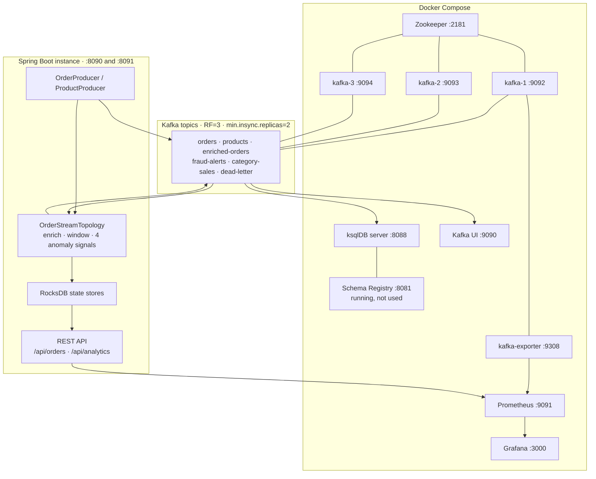

# Setup and Operation Guide
## Real-Time E-Commerce Order Analytics — Kafka Streams & ksqlDB

The project overview, architecture diagram, design rationale and known limitations live in
the [root README](../README.md). This file covers getting the stack running and driving it.

---

## Use case

Order events flow through a streaming pipeline that:

- **Enriches** each order with product catalog data (KStream–KTable left join)
- **Aggregates** sales per category in 1-minute **event-time** tumbling windows, with a
  30-second grace period and suppression so each window emits one final result
- **Screens** every order with four independent anomaly signals — `HIGH_VALUE`,
  `VELOCITY`, `SESSION_BURST`, `BASELINE_DEVIATION` — merged into one `fraud-alerts` topic
- **Tracks** lifetime spend per customer in a state store served over REST by Kafka Streams
  Interactive Queries, across multiple instances
- **Exposes** the same topics to ksqlDB for SQL push and pull queries

---

## Prerequisites

| Tool | Version | Notes |
|---|---|---|
| JDK | **21** | Required. The Gradle build declares a Java 21 toolchain. |
| Docker | recent | Docker Desktop, Colima or equivalent, with Compose v2 |
| Gradle | 8.5 | Via the bundled `./gradlew` wrapper — no separate install |
| curl, python3 | any | Used by `scripts/demo.sh` for pretty-printing |

Gradle will resolve or provision a JDK 21 through its toolchain support. If it cannot find
one, set `JAVA_HOME` explicitly before running the wrapper:

```bash
# macOS
export JAVA_HOME=$(/usr/libexec/java_home -v 21)
# Linux (example path)
export JAVA_HOME=/usr/lib/jvm/java-21-openjdk

java -version   # should report 21.x
```

`scripts/setup.sh` still checks for Java 17+; that check is looser than the build's actual
requirement, which is 21.

---

## Quick start

### 1. Optional: run the setup script

```bash
bash scripts/setup.sh
```

Checks Java and Docker, downloads the Gradle wrapper jar if it is missing, and pre-pulls
the Docker images. Everything it does is optional if you already have a working toolchain.

### 2a. Everything in Docker

```bash
docker compose up -d
```

This starts, in dependency order: Zookeeper → `kafka-1`, `kafka-2`, `kafka-3` →
`kafka-setup` (creates the six topics, then exits 0) → Schema Registry → `ksqldb-server` →
`ksqldb-setup` (runs `ksql/init.sql`, then exits 0) → `ksqldb-cli` → `kafka-ui`, and
alongside them **two application instances** (`app-1` on :8090, `app-2` on :8091, built
from the `Dockerfile`) plus `kafka-exporter`, Prometheus (:9091) and Grafana (:3000).

The first run builds the application image, which takes a few minutes.

```bash
docker compose ps                     # kafka-setup / ksqldb-setup should read "Exited (0)"
curl -sf http://localhost:8088/info   # ksqlDB
curl -s  http://localhost:8090/api/analytics/streams/status   # instance 1
curl -s  http://localhost:8091/api/analytics/streams/status   # instance 2
open http://localhost:9090            # Kafka UI
```

The two app containers are capped at 1 GB each with `mem_limit`. On macOS and Windows the
whole stack is bounded by the Docker Desktop VM's memory allocation, which commonly
defaults to 8 GB; if containers get OOM-killed, raise it or use option 2b.

### 2b. Infrastructure in Docker, application on the host

Better for iterating on the topology. Naming the infrastructure services explicitly leaves
ports 8090/8091 free (their `depends_on` pulls in Zookeeper):

```bash
docker compose up -d kafka-1 kafka-2 kafka-3 kafka-setup \
                     schema-registry ksqldb-server ksqldb-setup kafka-ui

./gradlew bootRun
```

Or build a JAR:

```bash
./gradlew build
java -jar build/libs/ecommerce-kafka-streaming-0.0.1-SNAPSHOT.jar
```

Watch for these lines in the log:

```
✅ Kafka Streams topology built successfully
📦 Initialising product catalog (20 products)...
Interactive Queries: this instance advertises itself as localhost:8090
```

> The startup banner printed by `EcommerceStreamingApplication` says port 8080. That is
> wrong — `application.yml` sets `server.port: 8090`, which is the port to use.

A second host instance needs nothing but a different port — the advertised
`application.server` address defaults to `localhost:${server.port}`, and the RocksDB state
directory leaf is derived from `host-port` so the two JVMs do not fight over RocksDB's
exclusive directory lock:

```bash
./gradlew bootRun --args='--server.port=8091'
```

In a container or Kubernetes you **must** set `app.streams.application-server` to an
address the other pods can reach — `localhost` inside a pod resolves to that pod. The
compose services set `app-1:8090` / `app-2:8091`; the Kubernetes StatefulSet uses its
headless-service DNS name.

### 3. Drive it

```bash
bash scripts/demo.sh
```

> `scripts/demo.sh` currently points at `http://localhost:8080` and will fail against the
> app's actual port. Either run the commands in [commands.md](commands.md) by hand, or
> override the base URL in the script.

### 4. Build and test

```bash
./gradlew test               # fast, hermetic — no Docker, no broker
./gradlew integrationTest    # the @Tag("integration") tests; needs a running Docker daemon
./gradlew build              # compile + unit tests + boot jar
```

---

## Architecture



The compose stack runs **two** instances of the `APP` block (`app-1` on :8090, `app-2` on
:8091) sharing one `application-id`, so the partitions — and therefore each state store —
are split between them.

---

## Kafka topics

| Topic | Partitions | Key | Value | Written by |
|---|---|---|---|---|
| `orders` | 3 | `orderId` | `Order` JSON | Spring Boot producer |
| `products` | 3, compacted | `productId` | `Product` JSON | `ProductProducer` at startup |
| `enriched-orders` | 3 | `orderId` | `EnrichedOrder` JSON | Streams topology |
| `fraud-alerts` | 1 | **`customerId`** | `OrderAlert` JSON | Streams topology, all four signals |
| `category-sales` | 3 | `category` | `CategorySales` JSON | Streams topology |
| `dead-letter` | 3, 30-day retention | original key bytes | original value bytes + `dlq.*` headers | deserialization exception handler |

All are RF=3 with `min.insync.replicas=2`. Kafka Streams' own internal repartition and
changelog topics (prefixed `ecommerce-streams-app-`) use the same settings, set through
`StreamsConfig.REPLICATION_FACTOR_CONFIG`.

`fraud-alerts` is keyed by `customerId`, not `orderId`: every alert about one customer then
lands on one partition in order, which is what a consumer correlating signals wants. The
two aggregate signals (`VELOCITY`, `SESSION_BURST`) describe a window rather than a single
order, so they leave `orderId`, `productId` and `category` null on purpose.

---

## State stores

| Store | Type | Contents | Queryable over REST |
|---|---|---|---|
| `category-sales-store` | window | per-`(category, 1-minute window)` aggregate | yes |
| `customer-spending-store` | key-value | lifetime running spend per customer | yes |
| `customer-velocity-store` | window | hopping 5m/1m aggregate, backs `VELOCITY` | no |
| `customer-session-store` | session | 5-minute-gap session aggregate, backs `SESSION_BURST` | no |
| `products-store` | key-value | materialised product catalog KTable | no |

---

## REST API

Base URL `http://localhost:8090`.

### Orders

```bash
# Publish one order (orderId and timestamp are generated if omitted) → 202
curl -s -X POST http://localhost:8090/api/orders \
  -H "Content-Type: application/json" \
  -d '{"customerId":"C001","productId":"P001","category":"Electronics","amount":2499.99,"quantity":1}'

# Publish a batch → 202
curl -s -X POST http://localhost:8090/api/orders/batch \
  -H "Content-Type: application/json" \
  -d '[{"customerId":"C002","productId":"P003","category":"Electronics","amount":349.99,"quantity":1}]'

# Simulate N random orders now
curl -s -X POST "http://localhost:8090/api/orders/simulate?count=20"

# Start / stop / inspect the continuous simulator
curl -s -X POST "http://localhost:8090/api/orders/simulate/start?intervalMs=2000"
curl -s -X POST  http://localhost:8090/api/orders/simulate/stop
curl -s          http://localhost:8090/api/orders/simulate/status
```

### Analytics — Interactive Queries

```bash
# Windowed category sales. from/to are ISO-8601 EVENT-time instants matched against
# window START times, NOT wall clock. Pass them explicitly whenever you care.
curl -s "http://localhost:8090/api/analytics/category-sales?from=1970-01-01T00:00:00Z"

curl -s "http://localhost:8090/api/analytics/category-sales?from=2026-09-04T10:00:00Z&to=2026-09-04T10:05:00Z"

# windowMinutes is a convenience that still anchors on Instant.now(); it is only used
# when `from` is absent. Range 1..10080; anything else is a 400.
curl -s "http://localhost:8090/api/analytics/category-sales?windowMinutes=5"

# Every customer, merged across every instance
curl -s "http://localhost:8090/api/analytics/customer-spending"

# One customer — a keyed lookup routed to the single instance owning that partition
curl -s "http://localhost:8090/api/analytics/customer-spending/C001"

# Streams state + every discovered instance with its stores and partitions.
# Always 200, even mid-rebalance.
curl -s "http://localhost:8090/api/analytics/streams/status"
```

**`local=true`** on any of the first three makes an instance answer from its own
partitions only, skipping peer discovery and RPC. It is the leg peers invoke on each other
and the reason the fan-out terminates. Use it by hand to see which shard holds what:

```bash
curl -s "http://localhost:8090/api/analytics/customer-spending?local=true"
curl -s "http://localhost:8091/api/analytics/customer-spending?local=true"
```

**Check `partial` before you trust a total.** State stores are sharded by partition, so an
unkeyed scan has to query every instance. When one cannot be reached, the response is still
`200` and still contains real data, but it is a subset:

```jsonc
{
  "partial": true,
  "hostsQueried": ["localhost:8090", "localhost:8091"],
  "failures": [{ "host": "localhost:8091", "reason": "TIMEOUT",
                 "detail": "Did not answer within the 5000ms fan-out budget." }],
  "totalCustomers": 7,
  "customers": [ ... ]
}
```

`reason` is one of `TIMEOUT`, `RPC_FAILED`, `STORE_NOT_AVAILABLE`, `REBALANCING`,
`NO_APPLICATION_SERVER`, `INTERRUPTED`, `QUERY_FAILED`. If every host fails, the request
returns `503` instead of an empty list that would read as "no data".

`GET /api/analytics/customer-spending/{customerId}` has no `partial` field — there is
exactly one possible owner, so it either answers (with `servedBy` / `servedLocally`) or
`503`s. An unknown customer is `200` with `found: false`.

### Status codes

| Code | When |
|---|---|
| `200` | Normal answer, including `partial: true` |
| `400` | Bad `windowMinutes`, unparseable `from`/`to`, `from` after `to` |
| `503` + `Retry-After: 5` | Streams not `RUNNING`, ownership unknown mid-rebalance, store restoring, all hosts failed |
| `500` | Genuinely unexpected — a rebalance is deliberately not one |

Errors are JSON `ApiError` bodies with `status`, `code`, `message`, `path`,
`retryAfterSeconds`, `timestamp`.

### Actuator

```bash
curl -s http://localhost:8090/actuator/health
curl -s http://localhost:8090/actuator/metrics
```

`application.yml` also lists `kafkastreams` in
`management.endpoints.web.exposure.include`, but Spring Boot 3.2 ships no endpoint by that
name, so `/actuator/kafkastreams` does not exist. Use `/api/analytics/streams/status` for
Streams state.

The compose app containers override the exposure list to `health,info,metrics,prometheus`,
because `monitoring/prometheus.yml` scrapes them at `/actuator/prometheus`. That endpoint
only exists if `micrometer-registry-prometheus` is on the application classpath — check
`build.gradle.kts` before relying on those metrics; without it the scrape returns 404 and
only `kafka-exporter` data reaches Prometheus.

---

## Observability

| Service | URL | Credentials |
|---|---|---|
| Prometheus | http://localhost:9091 | — (9090 is taken by Kafka UI) |
| Grafana | http://localhost:3000 | anonymous viewer; `admin` / `admin` |
| kafka-exporter | http://localhost:9308/metrics | — |

`monitoring/prometheus.yml` scrapes `kafka-exporter` (broker, topic and consumer-group
metrics, with `__consumer_offsets` and `__transaction_state` dropped) and both app
instances. Alert rules live in `monitoring/rules/`; a Grafana dashboard is provisioned from
`monitoring/grafana/dashboards/` as the default home dashboard.

---

## Container image and Kubernetes

`Dockerfile` builds a three-stage image: JDK 21 build → layered-jar extract → JRE 21
runtime. It runs as non-root UID 10001 with a read-only root filesystem; only
`/var/lib/kafka-streams` (RocksDB state) and `/tmp` are writable, and both are mounted from
outside. The heap is sized with `-XX:MaxRAMPercentage=60` rather than a fixed `-Xmx`,
deliberately below the usual 75% because RocksDB keeps its block cache and memtables
off-heap.

`k8s/` holds plain manifests: namespace, ConfigMap, Secret, headless Service, ClusterIP
Service, StatefulSet, PodDisruptionBudget and HPA. Two consequences of the design above are
visible there:

- It is a **StatefulSet with a headless Service**, not a Deployment, because each instance
  needs a stable identity to advertise as `app.streams.application-server` and a stable PVC
  for its state.
- The HPA's `maxReplicas` is capped by the **partition count of `orders`**, not by load:
  Kafka assigns at most one instance per partition, so extra replicas would sit idle
  holding no state.

The StatefulSet's image reference is a placeholder
(`ghcr.io/OWNER/kafka-streaming-analytics:REPLACE_WITH_GIT_SHA`) and must be substituted
before applying.

---

## ksqlDB

### Open the CLI

```bash
docker exec -it ksqldb-cli ksql http://ksqldb-server:8088
```

`ksql/init.sql` is executed automatically by the `ksqldb-setup` container on
`docker compose up`. To re-run it manually:

```sql
SET 'auto.offset.reset' = 'earliest';
RUN SCRIPT '/ksql/init.sql';
```

### Objects created by init.sql

| Object | Type | Source |
|---|---|---|
| `orders_stream` | STREAM | `orders` topic, `TIMESTAMP='timestamp'` |
| `enriched_orders_stream` | STREAM | `enriched-orders` topic |
| `fraud_alerts_stream` | STREAM | `fraud-alerts` topic |
| `high_value_orders` | STREAM | persistent query: `amount > 500` over `orders_stream` |
| `electronics_orders` | STREAM | persistent query: `category = 'Electronics'` |
| `category_sales_1min` | TABLE | `WINDOW TUMBLING (SIZE 1 MINUTE)` |
| `category_sales_hourly` | TABLE | `WINDOW HOPPING (SIZE 1 HOUR, ADVANCE BY 15 MINUTES)` |
| `customer_spending` | TABLE | unwindowed running totals |
| `fraud_by_category` | TABLE | aggregate over `fraud_alerts_stream` |

### Sample queries

```sql
-- Live order feed (push query)
SELECT orderId, customerId, category, amount FROM orders_stream EMIT CHANGES LIMIT 5;

-- Windowed category aggregation
SELECT category, order_count, total_sales FROM category_sales_1min EMIT CHANGES;

-- Point-in-time pull query
SELECT category, order_count, total_sales
FROM category_sales_1min
WHERE category = 'Electronics';

-- Running customer totals (the table is called customer_spending)
SELECT customerId, total_orders, total_spent FROM customer_spending EMIT CHANGES LIMIT 10;

-- Alerts as the Java topology writes them
SELECT alertId, customerId, alertType, severity, amount FROM fraud_alerts_stream EMIT CHANGES;
```

Two things to know about the ksqlDB layer:

- **`amount` is declared `DOUBLE`.** The Java side moved to `BigDecimal` precisely to stop
  float error compounding across a window's SUM; the ksqlDB aggregates still carry it. The
  two engines agree closely, not exactly, and the ksqlDB figures are the less exact ones.
- **`fraud_by_category` sees only two of the four signals.** It groups by `category`, and
  `VELOCITY` / `SESSION_BURST` alerts leave `category` null because they describe a window
  rather than one order — ksqlDB drops null grouping keys. `fraud_alerts_stream` also has
  no `reason` column, so the text explaining an aggregate alert is not visible in SQL.

`ksql/queries.sql` is a demo query library, but several of its statements are stale: it
uses snake_case column names (`order_id`, `customer_id`, `product_name`) that
`ksql/init.sql` never declares, and refers to a table `customer_spending_total` that does
not exist. Prefer the queries above.

---

## Kafka CLI

The broker container is `kafka-1` (there are three; older notes referring to a container
called `kafka` predate the multi-broker setup).

```bash
# Topics
docker exec kafka-1 kafka-topics --bootstrap-server localhost:9092 --list
docker exec kafka-1 kafka-topics --bootstrap-server localhost:9092 --describe --topic orders

# Watch a topic
docker exec -it kafka-1 kafka-console-consumer \
  --bootstrap-server localhost:9092 --topic fraud-alerts --from-beginning

# Streams consumer group lag
docker exec kafka-1 kafka-consumer-groups \
  --bootstrap-server localhost:9092 --describe --group ecommerce-streams-app

# Dead-letter contents, with the failure headers
docker exec -it kafka-1 kafka-console-consumer \
  --bootstrap-server localhost:9092 --topic dead-letter --from-beginning \
  --property print.headers=true
```

Because the topology runs `EXACTLY_ONCE_V2`, add `--isolation-level read_committed` to a
console consumer if you want to see only committed records.

---

## Project structure

```
kafka-streaming-analytics/
├── build.gradle.kts                        Gradle Kotlin DSL, Java 21 toolchain
├── settings.gradle.kts
├── docker-compose.yml                      3 brokers, Schema Registry, ksqlDB, Kafka UI
│
├── src/main/java/com/ecommerce/streaming/
│   ├── EcommerceStreamingApplication.java
│   ├── config/
│   │   ├── KafkaTopicConfig.java                        NewTopic beans, RF=3 / minISR=2
│   │   ├── KafkaStreamsConfig.java                      EOS_V2, event time, app server, state dir
│   │   ├── OrderTimestampExtractor.java                 payload event time with fallbacks
│   │   ├── DeadLetterDeserializationExceptionHandler.java
│   │   └── InteractiveQueryClientConfig.java            RestClient with bounded timeouts
│   ├── model/
│   │   ├── Order / Product / EnrichedOrder / OrderAlert
│   │   ├── CategorySales / CustomerSpending             BigDecimal aggregates with merge()
│   │   └── query/                                       REST DTOs incl. partial + failures
│   ├── serde/JsonSerde.java
│   ├── producer/                                        OrderProducer, ProductProducer
│   ├── streams/OrderStreamTopology.java                 the topology
│   ├── service/
│   │   ├── InteractiveQueryService.java                 discovery, fan-out, merge, partials
│   │   └── DataSimulator.java
│   ├── controller/                                      OrderController, AnalyticsController
│   └── exception/                                       ApiError + @RestControllerAdvice
│
├── src/main/resources/application.yml
├── src/test/java/com/ecommerce/streaming/
│   ├── streams/                            TopologyTestDriver tests: enrichment join,
│   │                                       category windowing, customer-spending store,
│   │                                       fraud signals, deterministic alert identity
│   └── support/                             Test fixtures and stubs
│
├── Dockerfile                              3-stage layered build, non-root, read-only rootfs
├── .github/workflows/ci.yml                Build + tests, image build + Trivy scan
├── k8s/                                    Namespace, config, services, StatefulSet, PDB, HPA
├── monitoring/                             Prometheus config + rules, Grafana provisioning
├── docker/                                 kafka-init.sh, ksql-init.sh
├── ksql/                                   init.sql, queries.sql
├── scripts/                                setup.sh, demo.sh
└── docs/                                   this file, commands.md, code-explanation.md,
                                            answer-sheet.md
```

---

## Stopping

```bash
# Spring Boot: Ctrl+C in the terminal running bootRun

docker compose down       # keep topic data
docker compose down -v    # wipe volumes for a clean slate
```

The RocksDB state directories live under `/tmp/kafka-streams/ecommerce/<host>-<port>/`.
Deleting them forces a full restore from the changelog topics on next start, which is a
useful way to exercise the restore path (and the `503` / `partial` behaviour while it runs).
